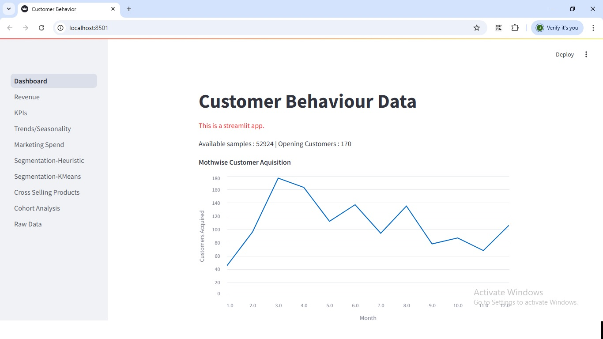

# Customer Behavior Insights


This repository contains a Streamlit-based application for analyzing customer behavior, marketing spend, and sales trends. The application provides various insights through interactive dashboards, charts, and data visualizations.

## Features

The application is structured into multiple pages, each focusing on a specific aspect of customer behavior and sales analysis:

1. **Dashboard**: Provides an overview of customer acquisition and behavior.
2. **Revenue Analysis**: Visualizes revenue trends month-wise and based on promotions.
3. **Key Performance Indicators (KPIs)**: Displays metrics like revenue, number of orders, average order value, and customer count.
4. **Trends and Seasonality**: Analyzes sales trends by product category, location, and month.
5. **Marketing Spend Analysis**: Examines the impact of marketing spend on revenue and daily sales.
6. **Customer Segmentation (Heuristic)**: Segments customers based on invoice value or RFM (Recency, Frequency, Monetary) analysis.
7. **Customer Segmentation (KMeans)**: Uses KMeans clustering to segment customers based on various features.
8. **Cross-Selling Analysis**: Identifies frequently purchased product bundles.
9. **Cohort Analysis**: Analyzes customer retention and behavior over time.
10. **Raw Data**: Displays the raw data used in the analysis.

## File Structure

```
.
├── app.py                     # Main application file
├── CustomersData.xlsx         # Customer data
├── Discount_Coupon.csv        # Discount coupon data
├── Marketing_Spend.csv        # Marketing spend data
├── Online_Sales.csv           # Online sales data
├── Tax_amount.xlsx            # Tax amount data
├── pages/                     # Folder containing individual page scripts
│   ├── cohort.py              # Cohort analysis
│   ├── crosseda.py            # Cross-selling analysis
│   ├── Dashboard.py           # Dashboard overview
│   ├── kmeans.py              # KMeans segmentation
│   ├── Kpis.py                # Key performance indicators
│   ├── RawData.py             # Raw data display
│   ├── Revenue.py             # Revenue analysis
│   ├── segment.py             # Heuristic segmentation
│   ├── spend.py               # Marketing spend analysis
│   ├── trends.py              # Sales trends and seasonality
├── requirements.txt           # Python dependencies
└── README.md                  # Project documentation
```

## Installation

1. Clone the repository:

   ```bash
   git clone https://github.com/your-username/customer-behavior-insights.git
   cd customer-behavior-insights
   ```

2. Install the required dependencies:

   ```bash
   pip install -r requirements.txt
   ```

3. Place the required data files (`CustomersData.xlsx`,Discount_Coupon.csv,Marketing_Spend.csv,Online_Sales.csv,Tax_amount.xlsx) in the root directory.

## Usage

Run the Streamlit application:

```bash
streamlit run app.py
```

Navigate to the URL provided by Streamlit to interact with the application.

## Dependencies

The application requires the following Python libraries:

- numpy

- pandas

- matplotlib

- seaborn

- streamlit

- `scikit-learn`
- `openpyxl`

Refer to the requirements.txt file for the exact versions.

## Data Sources

- **CustomersData.xlsx**: Contains customer information.
- **Discount_Coupon.csv**: Details of discount coupons and their percentages.
- **Marketing_Spend.csv**: Data on offline and online marketing spend.
- **Online_Sales.csv**: Transaction data for online sales.
- **Tax_amount.xlsx**: Tax-related data.

## Pages Overview

### Dashboard

Displays an overview of customer acquisition and behavior.

### Revenue Analysis

Visualizes revenue trends month-wise and based on promotions.

### KPIs

Shows key performance indicators like revenue, orders, and customer count.

### Trends and Seasonality

Analyzes sales trends by category, location, and month.

### Marketing Spend

Examines the impact of marketing spend on revenue and daily sales.

### Customer Segmentation (Heuristic)

Segments customers based on invoice value or RFM analysis.

### Customer Segmentation (KMeans)

Uses KMeans clustering to segment customers.

### Cross-Selling Analysis

Identifies frequently purchased product bundles.

### Cohort Analysis

Analyzes customer retention and behavior over time.

### Raw Data

Displays the raw data used in the analysis.

## Contributing

Contributions are welcome! Please fork the repository and submit a pull request with your changes.

## License

This project is licensed under the MIT License. See the LICENSE file for details.
